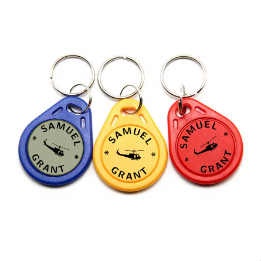

## Templates for RFID Keyfob Tags

In addition to standard business card designs, this repository includes templates specifically tailored for **circular keyfob tags**. These tags are ideal for **access control**, **identification**, or **promotional purposes**.

- **Keyfob Dimensions**: The templates are designed for a **25 mm diameter (0.98 in)**.
- **Customizable Layouts**: You can personalize text, colors, logos, and QR codes.

### Keyfob Design Specifications

- **Front Side**:
  - The logo is placed at the center.
  - Text (e.g., company name or tagline) is arranged in a circular pattern around the logo.
  
- **Back Side**:
  - A **QR code** is positioned centrally within a circular border.
  - Optional: Include a small description or identifier near the QR code.

---

### Keyfob Design Examples

**Front Side**:  
Circular layout with logo in the center and text wrapped around it.  

**Back Side**:  
Circular QR code design with optional border or identifier.  

---

### Getting Started

1. **Customize the Front Design**:
   - Replace the placeholder logo in the `.tex` file with your logo.
   - Edit the circular text to include your desired text (e.g., "Your Company Name").
   
2. **Customize the Back Design**:
   - Generate a QR code with your information (e.g., a URL or contact details).
   - Replace the placeholder QR code in the `.tex` file with the generated QR code.

3. **Compile the Design**:
   - Use your LaTeX editor or Overleaf to compile the `.tex` file for printing.

4. **Print Instructions**:

   - Verify the circular designs align with the sticker cutouts by testing on plain paper before final printing.
   - Use adhesive sticker paper to print the designs and carefully cut out the circles if not pre-cut.

5. **Preview Examples**:

   - Check example designs below for inspiration or reference.

  

These templates allow you to create professional and functional **keyfob tags** that integrate seamlessly with your RFID-based systems or promotional campaigns.
