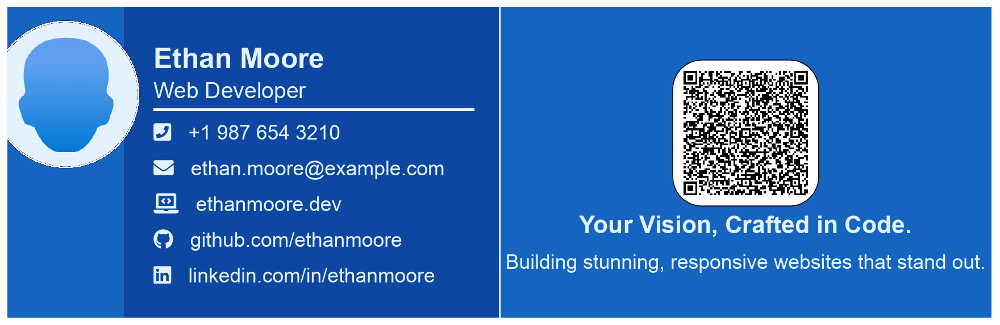
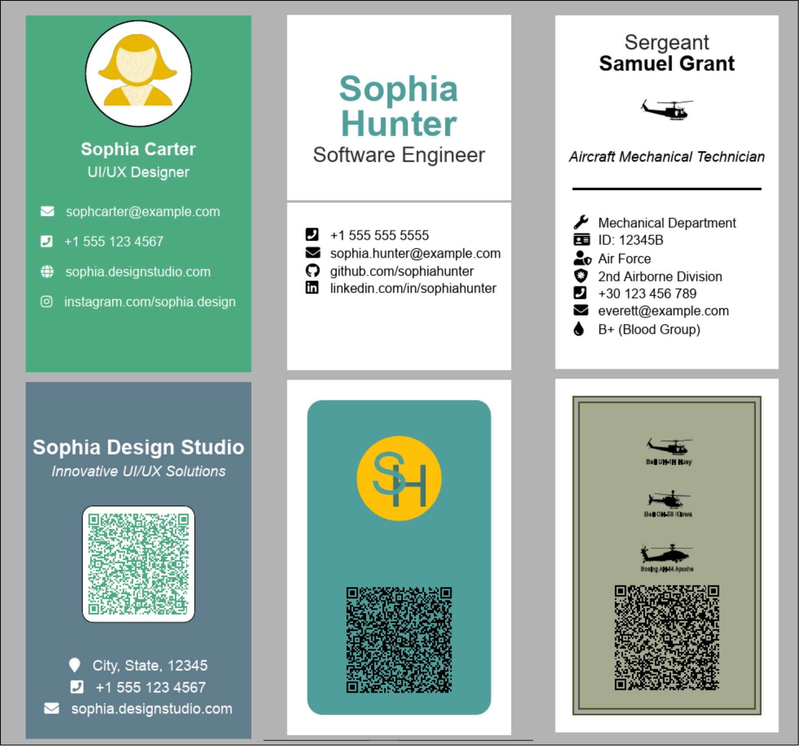

# LaTeX Business Cards: Stylish & Customizable Templates


A collection of **elegant and professional** LaTeX templates for creating business cards with ease. Whether you need a **minimalist design**, a **military-inspired style**, or a **modern corporate look**, these templates can be easily customized to fit your needs. Add **QR codes**, **FontAwesome icons**, logos, and personal details with just a few tweaks. You can even print them onto **RFID cards** if preferred!

## Features

- **Customizable Templates**: Select from a variety of pre-designed business card styles.
- **QR Code Support**: Easily add your contact information with a scannable QR code.
- **Icon Integration**: Use FontAwesome icons for a sleek and modern look.
- **Multiple Layouts**: Vertical, horizontal, rounded corners, and more!
- **Easy Customization**: Modify text, colors, logos, and icons to make the card truly yours.
- **RFID Card Printing**: If you prefer, you can print your business cards onto RFID cards for digital integration.

---

## Integration with RFID-AttendTrack

The [RFID-AttendTrack](https://github.com/Paschalis/RFID-AttendTrack) project automates attendance tracking using RFID technology. These LaTeX templates can be used to design **RFID-enabled business cards** that serve as both professional cards and attendance badges.

### Key Use Cases
- **Dual-Purpose Cards**: Combine business cards with RFID functionality for seamless attendance tracking.  
- **Stylish & Functional**: Create branded, elegant designs that work with the AttendTrack system.  
- **Easy Sync**: Track attendance, view records, and generate reports with RFID-AttendTrack.  

> **Tip:**  
> Pair these LaTeX templates with the RFID-AttendTrack system to create a unified and efficient solution for professional and functional RFID-enabled cards.

<div align="center">

[](https://github.com/Paschalis/RFID-AttendTrack)  
[](https://github.com/Paschalis/RFID-AttendTrack/stargazers)
[](https://github.com/Paschalis/RFID-AttendTrack/network/members)
[](https://github.com/Paschalis/RFID-AttendTrack/commits/main)

</div>

---

## Business Card Designs

Below are previews of various business card designs created using the LaTeX templates. Each card showcases both the front and back sides together for easy viewing.

### Design 1



This design features a modern layout with a focus on clean lines and bold colors. You can customize the contact details, logo, and add a QR code to the back side.

### Design 2


This design emphasizes a minimalistic approach with simple typography and an elegant color scheme. It’s perfect for those who prefer a sleek and professional look.

### Vertical Business Card Designs Collection

Below are different variations of vertical business card designs:



> **Note:**  
> Feel free to modify these templates to match your personal or business style. Each card design is fully customizable, offering flexibility to suit various branding needs.

## Getting Started

### 1. Clone this repository:

```bash
git clone https://github.com/yourusername/latex-business-cards.git
cd latex-business-cards
```

### 2. Compile your LaTeX document:

Use a LaTeX editor like Overleaf or a local LaTeX environment to compile the `.tex` file into a professional business card.

```bash
pdflatex business_card_template.tex
```

### 3. Customize your card:

- Edit the **name**, **contact details**, and **logos** directly in the `.tex` file.
- Add your own **QR code** by replacing the current content with your vCard or contact information.
- Adjust **colors** and **fonts** to match your brand or personal style.

### 4. Print onto RFID cards:

If you prefer to have your business card as an **RFID card**, simply export your LaTeX document to PDF and print it using an RFID card printer that supports your preferred format. This way, you can make your business card interactive and tech-savvy!

> **Note:**  
> The standard dimensions for the business card templates in this repository are **85.6 mm × 54 mm (3.37 in × 2.13 in)**, the typical size for professional business cards. These dimensions can be customized in the `.tex` file to suit other formats.

## Examples

Here are a few examples of what you can create with these templates:

- **Military Style**: A bold and sturdy design suitable for military or tactical professions.
- **Corporate Minimalist**: A clean and professional card for business professionals.
- **Tech Specialist**: Ideal for engineers, developers, or tech enthusiasts, with icons like the wrench or microchip.

## Contributing

We welcome contributions! If you have a new layout, style, or feature to add, feel free to submit a pull request.

## License

This repository is licensed under the MIT License - see the [LICENSE](LICENSE) file for details.

---

**Ready to create your perfect business card?** Clone the repository, tweak the templates, and print your professional new card today—whether on paper or onto an **RFID card** for a cutting-edge touch!
